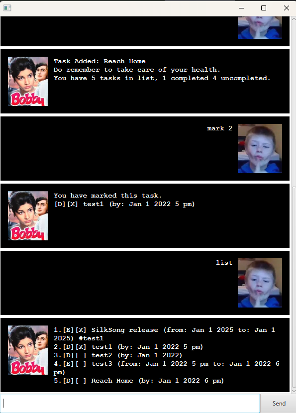
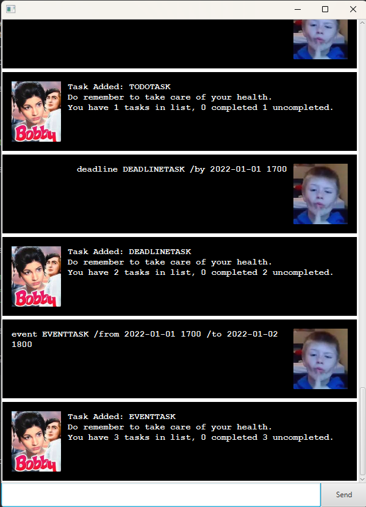

# Bobby User Guide

// Product intro goes here
Get a neat little task manager in the form of *Bobby*.

Bobby is:
- Fast
- Saves your tasks for easy access
- Can manage tasks of different types. (todo, deadline, event)

To start using Bobby:
1. Download it from [here](https://github.com/Retribob/ip/releases/tag/A-Jar)
2. Open the jar file
3. Add tasks of different types using todo/deadline/event
4. End Bobby using the command "bye"
5. Tasks are saved on exit! 😄

> God gave you hands to use Bobby - Anonymous

Currently implemented:
- [x] Adding and displaying tasks
- [x] Adding different types of tasks
- [x] Supporting date and times
- [x] Added tagging support
- [x] filter by name
- [x] mark and unmark tasks as complete

## Displaying Tasks
Enter the command: `list`

Should display the tasks added in chronological order.

## Adding Tasks

// Describe the action and its outcome.
You can add up to three types of tasks.
1. Todo: `todo <task name>`
2. Deadline: `deadline <task name> /by <YYYYmmdd> <HHmm>`
3. Event: `event <task name> /from <YYYYmmdd> <HHmm> /to <YYYYmmdd> <HHmm>`

Note that you do not need to strictly follow the date and time format.

// Give examples of usage

## Marking/Unmarking Tasks

You can mark/unmark tasks as complete

Example: `mark 1`
Example: `unmark 1`

This marks the task listed as 1 in the task list as complete/incomplete.

## Deleting Tasks
You can delete tasks from the list.

Example: `delete 1`

Deletes the first task in the list.

## Tagging/untagging Tasks
You can tag/untag tasks in the list.

Example: `tag 1 TestTag`

This tags the first tag in the list with the tag "#TestTag"

You can view tags added by entering the `list` command.

### Credits for images
[Bobby chatbot image](https://i.ytimg.com/vi/5uQTb-HoUxU/hq720.jpg?sqp=-oaymwEhCK4FEIIDSFryq4qpAxMIARUAAAAAGAElAADIQj0AgKJD&rs=AOn4CLA7rdwwgSm4PYQ27FHxm-xEKr-esw)

[User image](https://preview.redd.it/the-best-mewing-ive-ever-seen-v0-u4znu9ldoz5e1.jpeg?width=960&auto=webp&s=4ff853b9e1480d4c1b86e7973ae0a1a1b6d2125a)